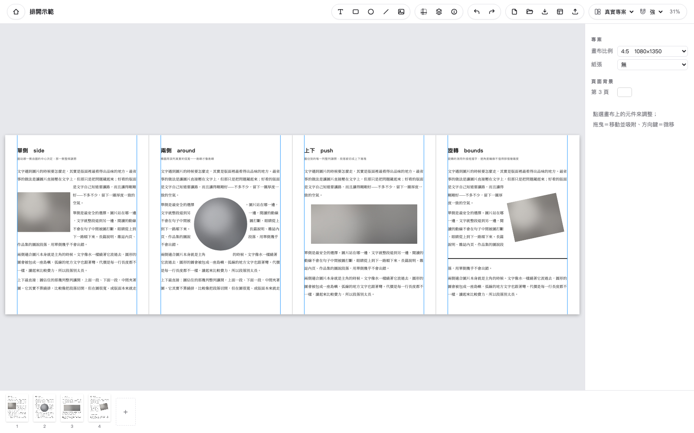

# ALIGNED for Mac

**IG 輪播的跨頁對齊排版工作檯（Mac・免費・開源）。**
由台灣廣告導演 [Armin Kao／小高](https://arminkao.com) 依自己的工作流打造。

跨頁對齊是招牌：整個專案是一條連續畫布，圖可以橫跨頁縫，IG 滑動時畫面連續。
拖曳吸附、參考線、群組對齊、九顆濾鏡、影片頁（匯出 mp4）、輕量範本交換、
系統字型＋字型檔匯入——桌面大螢幕十頁攤開，一眼驗收。



▶︎ **[一分鐘說明影片](docs/demo.mp4)**（點進去直接播放；有新功能會隨版本更新）

## 下載

👉 **[下載 ALIGNED for Mac（DMG）](https://github.com/qwert2813434-ctrl/ALIGNED/releases/latest/download/ALIGNED-macOS-arm64.dmg)**

這個連結**永遠指向最新版**，發新版不用改。想看各版本更新內容或抓舊版 → [Releases](https://github.com/qwert2813434-ctrl/ALIGNED/releases)。

📱 iPhone／iPad 版正在 App Store 審核中，上架後在這裡補連結。

**系統需求**：Apple Silicon（M1 或更新）、macOS 13 Ventura 或更新。
已通過 Apple 公證（Developer ID 簽名＋Notarization），下載後直接打開即可，不需要任何繞過步驟。

## 給 AI 用（這個 repo 的另一半重點）

ALIGNED 的專案檔是文件化的 JSON——**任何 AI 讀完規格就能直接產生「打開即可編輯」的專案**：
[docs/ALIGNED-AI-SPEC.md](docs/ALIGNED-AI-SPEC.md)。
Claude／GPT 排草稿 → ALIGNED 開檔微調 → 匯出發佈，這條流程已實測（手寫 JSON 經 App 本人的解碼器驗證）。

## 自己編譯

```bash
npm install
npm run tauri dev      # 開發（真 App 殼）
npm run tauri build    # 產 .app（需 Xcode Command Line Tools）
```

## 授權

- 程式碼：**GPL-3.0**（見 [LICENSE](LICENSE)）。
- 「ALIGNED」名稱與 Logo 為商標，**不在授權範圍內**——fork 請改名，避免混淆。
- 內嵌字型皆為 OFL 1.1，清單與版權見 [public/fonts/LICENSES.md](public/fonts/LICENSES.md)。
- 提交 PR 即表示你同意：你的貢獻以 GPL-3.0 釋出，並額外授權作者將其納入 iOS 版（雙授權）。

個人專案，回覆與維護盡力而為。This is a personal project; replies are best-effort.

---

> 以下為開發技術文件（引擎移植的完整歷史與地雷記錄）——對貢獻者與想懂內部構造的人有用，
> 一般使用者到上面為止就夠了。

# ALIGN Core

ALIGNED 引擎的 TypeScript + Canvas 移植。**一核多殼**的那個核：
Mac（Tauri，先出）→ Android（Capacitor）→ Windows。與 iOS 版並行，不取代。

計畫全文：`../未開工企劃/Android跨平台企劃.md`（私有工作區文件，不在本 repo）

## 跑起來

```bash
npm install
npm run dev            # http://localhost:5173
npm run build          # tsc --noEmit + vite build
./difftest/run.sh      # 對齊引擎 vs Swift 原版的差分測試
open http://localhost:5173/selftest.html   # 瀏覽器內互動自測
```

右上角可以開任何 `project.json`、切換範例、按「匯出 PNG」。
拖曳元件＝移動並吸附、拖曳空白＝平移、兩指捲動＝平移、捏合＝縮放。

## 測試策略（引擎移植必守）

「看起來對」不算移植成功。兩層驗證，**兩層都必須先證明自己抓得到 bug**
（把修正拿掉跑一次，確認會失敗），否則全綠只代表沒在測。

- **`difftest/run.sh`** — 對齊引擎與 iOS 的 Swift 原版跑同一批亂數測資（400 筆），
  逐案比對 frame／吸附旗標／參考線／等距徽章。已用三種突變驗證有效
  （閾值 8→7 抓到 8 筆、weak 誤比遠端邊抓到 14 筆、頁中心線寫成左緣抓到 4 筆）。
- **`filtertest/run.sh` ＋ `/filtertest.html`** — 九顆濾鏡與 iOS `FilterEngine` 的
  逐像素比對。參考器連結的是 **App 真正的原始檔**（腳本自動剝掉 UIKit 那 30 行，
  剝不掉就報錯），配方不是手抄的。目前九顆的平均誤差全在 2.7/255（1%）以內。
- **`selftest.html`** — 用真的指標事件驅動 Editor，驗證
  「指標座標 → 專案座標 → 吸附 → 寫回 frame」整條鏈。
  > ⚠️ **踩過的洞**：一開始的六個案例量的全是「位移差」，注入 7px 絕對偏移竟然全過——
  > 固定偏移在相減時抵銷了，等於絕對座標精度根本沒測到。補了「邊界精度」案例
  > （貼著元件左緣兩側各點一次）才抓得到。
  > **仍未覆蓋**：整頁 CSS zoom 與捲動下的座標偏移（那需要 WebKit／Chrome 兩種語意各跑一次）。

拿真實專案檔來測：範本是 AppleArchive/LZFSE，不是 zip，用系統的 `aa` 解：
```bash
aa extract -i "../TemplateForge/範本_輪播全集/17｜工作人員名單 Credits（7頁）.alignproj" -d /tmp/x
```

## 結構

```
src/core/     ← 平台無關，Android 殼原樣共用。**不准出現任何 Tauri／DOM／桌面專屬的東西**
  schema.ts     專案 JSON 解碼（iOS Swift Codable 的形狀翻譯）
  geometry.ts   座標系、頁矩形、旋轉 AABB、cropRect 語意
  fonts.ts      字型家族/字重 → 具體字面 → 檔案（AppFontCatalog 的移植）
  render.ts     canvas 渲染。`renderPageCanvas` 是**匯出與編輯預覽共用的唯一入口**
  align.ts      對齊引擎（AlignmentEngine 的逐條移植，有差分測試）
  filters.ts    九顆濾鏡（查找表＋顆粒貼片＋網屏表，有差分測試）
  paper.ts      整頁紙張（三層：multiply 紙色 → screen 抬黑 → softLight 纖維）
  export.ts     原尺寸 PNG 匯出
src/editor.ts ← 互動層：指標事件、命中判定、拖曳、view 變換。**DOM 只出現在這裡**
src/main.ts   ← Mac 殼的組裝
public/fonts  ← 23 個內嵌字型，從 iOS 專案 Sources/Fonts/ 複製
```

## 已驗證（2026-08-01，Phase 1 第 1 塊）

拿 92 份真實範本、2,423 個 block 做過欄位清冊，不是照 Swift 原始碼猜的。

- **schema 解碼**：7 頁範本完整讀進來並畫出，形狀、字色、字體、直排方向全對
- **Swift Codable 的三個形狀**（都已處理）：`CGRect` → `[[x,y],[w,h]]`、
  enum 關聯值 → `{"text":{"_0":…}}`、`AttributedString` → 文字與屬性交錯的陣列
- **字型內嵌**：源樣明體、思源宋體等 23 個字面在 canvas 上渲染品質良好
- **橫排文字**：字距、行高、對齊、中英混排、墨跡貼合（`actualBoundingBoxAscent`
  ＝ iOS `TextInkInset` 的等價物）都落在對的位置
- **直排字元進距**：`size + kern`，與 TemplateForge 的產生公式吻合
  （範本 frame 高度比排版高度大 10%，是 TemplateForge 刻意留的估值餘裕，不是誤差）

## 已驗證（2026-08-01 第二輪，Phase 1 第 3 塊）

- **對齊引擎移植完成且與 Swift 原版逐案相同**（400 筆亂數測資，0 不一致）。
  含三段磁性、頁邊/頁中心、使用者參考線、跨頁絕對與相對對齊、等距徽章。
- **互動畫布可用**：單一連續 stage（頁與頁無間隙，就是專案的座標語意）、
  選取（用真正的旋轉矩形判定而非外接框）、拖曳、即時吸附與參考線、平移縮放。
- **旋轉的坑一開始就避開了**：被拖的元件自己也換算旋轉外接框——
  iOS 端 2026-08-01 才修好的同一個 bug，這裡從第一版就是對的，並有自測案例守著。

## 已驗證（2026-08-03 第三輪，Phase 1 第 4–5 塊）

- **九顆濾鏡逐像素平均誤差全在 2.7/255（1%）以內**（見上一節的四個坑）。
- **整頁紙張**已實作。三種紙的纖維參數與濾鏡 c1/c3/c4 完全相同，直接共用貼片。
  目前 92 份範本與 iPad 上的專案都沒在用，但那是 iOS 已上線的功能，先做起來放。
- **匯出管線**：原尺寸 PNG（scale 1，畫布尺寸即像素），檔名補零帶頁碼。
  `photoLibraryOrder()` 保留了 iOS 那個「存相簿要反轉頁序」的產品細節
  （相簿是最近建立的排前面，倒著寫才會排成編輯順序）——存檔案不需要反轉。
- **預覽與匯出走同一支 `renderPageCanvas`**，所見即所得不會分家。
  有紙張時走離屏逐頁渲染，沒紙張時直接畫（拖曳才不會每格 getImageData）。

## 已驗證（2026-08-03 第四輪：編輯殼）

- **屬性檢視器＋頁面膠捲**（獨立元件，照「三塊可分離」約束）：文字全套樣式、
  形狀、媒體濾鏡／遮罩／外框即時調；膠捲點頁跳頁。方向鍵微移（⇧＝10）。
- **存檔 ⌘S**：`encodeProject` 把模型編回 iOS 形狀（frame→`[[x,y],[w,h]]`、
  enum→`{_0}`、文字→AttributedString runs 且**顏色烤進 runs**、updatedAt 剪掉毫秒
  ——iOS 的 ISO8601 解不了毫秒）。json 直接原子覆寫；`.alignproj` 寫回解包資料夾後
  用 `aa archive -a lzfse` 重新打包，首次覆寫自動留 `.bak`。
  ⚠️ **`aa archive` 打包的 .alignproj 尚未在 iPad 實測過能否匯入**——出貨前必驗。
- **復原 ⌘Z／重做 ⇧⌘Z**：「已提交影子」快照制，連續滑桿／按住方向鍵在 900ms 窗口
  內合併成一步。標題列 ● ＝有未存變更。
- **往返測試抓到一個真解碼 bug**：SwiftUI AttributedString 的顏色**存線性 RGB**
  （colorHex 8A8A8A＝sRGB 0.541 的 run 存 0.255）。原本直讀當 sRGB，中間調文字
  全體偏暗。解碼（線性→sRGB）與編碼（sRGB→線性）兩個方向都已修正。

## ⏸ 待小高定奪（會影響架構，先別自己決定）

1. **`.alignproj` 的跨平台容器**。現在是 AppleArchive + LZFSE，只有 Apple 平台解得開
   （Mac 可以呼叫系統的 `aa`，**Android／Windows 沒有**）。三條路：
   ① 跨平台版一律改用 zip（要處理與 iOS 既有檔的相容）；
   ② Mac 讀寫 `.alignproj`、Android 只吃裸 `project.json`；
   ③ 自己實作 LZFSE 解碼（成本最高）。
2. **Mac 版的系統預設字型**。iOS 端 `fontName` 為空＝PingFang TC。Mac 也有 PingFang，
   所以 Mac 可以與 iOS **像素級一致**；但 Android 沒有，必然落到內嵌的 Noto。
   → 要「Mac↔iOS 完全一致」還是「Mac↔Android 完全一致」？兩者不可兼得。
3. **Mac v1 的範圍**：檢視＋匯出就出貨（快、能立刻建立存在感），
   還是要做到能編輯才出？後者至少多兩到三個月。

## 濾鏡：能烤成表的就不要重算

移植濾鏡踩到的四個坑，每個都讓我一度以為「差不多對了」：

1. **色調曲線不能照控制點自己刻。** App 的 CIContext 工作空間是 sRGB，
   `CIToneCurve` 在該空間下的實際輸出不落在控制點上——faded 的 0/64/128/192/255
   出來是 3/71/129/174/211，照控制點刻會得到 26/79/136/192/235，整組顏色偏掉。
2. **顆粒層的 alpha 也是隨機的。** `CIColorMatrix` 只動 RGB 向量、alpha 直接穿過去，
   而 `CISoftLightBlendMode` 是 alpha 感知的。當成不透明層混，誤差 12；照標準
   alpha 合成，誤差 2。
3. **`CIRandomGenerator` 的重複單元只有 256×256**（兩軸位移 256 誤差皆為 0），
   所以整層顆粒烤成貼片平鋪就精確。別想著導原始噪點自己算——它連 alpha 都是隨機的，
   存 PNG 走預乘會失真，讀回來根本不是原值。
4. **`CIDotScreen` 不是 sin·sin。** 拿它擬合殘差 37/255＝完全不對。實測它是
   「週期內相對位置 × 亮度」的函數，**角度 −0.3 rad**（不是配方寫的 +0.3，
   CI 的 y 軸朝上所以符號相反）、間距 5.0 px。烤成 32×32×17 的表（17 KB）
   之後 c1 的誤差從 47.8 掉到 1.65。

沒有完全模型化的只剩 `CIBloom`（演算法未公開），影響 b5，誤差 2.69。

## 已驗證（2026-08-04 第五輪：長文框／排開／空欄位）

- **長文框（isBodyFrame）**：固定容器、超出裁切、垂直對齊（無洞時）——`drawBodyFrame`。
- **排開文字（文繞圖）**：`textwrap.ts` 逐條移植 iOS `TextWrap.swift`——只作用於長文框
  ＋橫排＋未旋轉（iOS 拍板同款）；side（預設，圖的中心定側、不在句中跳圖）／around
  （島嶼，橢圓用真實弧寬）／push（整列讓開）；margin 18；線條的洞貼墨跡；
  「一個字都塞不下的段留空、絕不滲進洞」。
- **空欄位框（範本欄位）**：墨色依頁底亮暗切換（iOS emptySlotPlaceholder 同款），
  **匯出也畫**——這是範本的本體不是編輯器裝飾。**雙擊空欄位＝選檔填圖**（＝iOS 的
  點欄位挑照片），檢視器也有「選擇／更換圖片影片」鈕；選影片自動抓海報並轉型，
  裁切與拉直重置、遮罩描邊濾鏡排開設定保留。

> 直排的「逐字體欄距補償」**不必移植**：把 iOS 那三段公式代開會發現最終欄距恆為
> 1.22em × 行高倍數，字體被消掉了——那套補償的用途是抵銷 CoreText 自作主張套上的
> 字體自然欄距，canvas 是自己逐欄擺位的，沒有東西要抵銷。

## 已驗證（2026-08-04 第六輪：影片預覽會播＋八點手把）

- **影片在畫布上會播**（`videopool.ts`）：靜音、自動循環，`<video>` 直接當
  CanvasImageSource。三個刻意的取捨寫在檔頭——匯出／縮圖**仍畫海報圖**（決定性優先，
  同一份專案匯出兩次要一樣）、有濾鏡的逐格套在長邊 512px 的暫存畫布、整台 stage
  重畫節流到 20fps。一個檔一個播放器，同檔不同濾鏡共用解碼；換濾鏡與新匯入的影片
  由每一拍自己接上，不用重啟播放。
- **八點手把**（角＝縮放、邊＝裁切，iOS 2026-07-05 的定案逐條照搬）：
  - **角（圓點）**：對角錨定，照片／影片等比鎖、不動 cropRect；形狀自由拉；
    最小尺寸 canvasWidth×5%（iOS 同值）；未旋轉時兩條移動中的邊都吃吸附
    （等比時兩軸比距離、近的贏，同 iOS `snapAspectLockedEdges`）。
    **旋轉過的元件照拉**：指標換算回未旋轉座標系算尺寸，再由錨點反推 frame。
  - **邊（長條）**：真裁切——frame 與 cropRect 同步收放，所以**錨定側的畫面
    逐像素不動**；往外拉露出藏起來的部分，上限是 cropRect 撞到素材邊緣。
    起手先把 aspect-fill 實體化進 cropRect（(0,0,1,1) 是哨兵值不是字面值，
    不攤開的話下筆瞬間會從置中裁切跳成整張拉伸）。只給未旋轉的媒體。
  - **螢幕上太小就不長手把**（角 28px、邊 56px）——抓取範圍是固定螢幕尺寸，
    小元件會被手把整個吃掉、變成拖不動。
  - 文字兩種都不給——文字的框是貼字盒，尺寸由字級與內容決定。
- 驗證：自測 36/36，**四個新案例都做過突變測試**——拿掉旋轉補償→「旋轉後對角視覺
  位置不動」FAIL；drawMedia 不看即時影格→「影片畫即時影格」FAIL；裁切時 cropRect
  不同步收→「錨定側逐像素不動」FAIL（像素差 218）；拿掉素材邊緣上限→「往外拉到底就停」
  FAIL（寬度衝到 1400、cropRect 跑到 −1.75）。
  裁切的驗收刻意用**逐像素比對**而不是數字：frame 與 cropRect 只要有一邊算錯，
  照片就會滑動或縮放，而數字（寬度、crop 值）各自看起來都還「合理」。
  另外跑真 App 端對端（`videoprobe.html` + `public/samples/_probe`，開發專用不進包）：
  畫布上讀到 timecode 00:00:02.867、頁面縮圖仍是海報＝兩條路確實分開。

> headless Chrome 的 `--virtual-time-budget` **不能拿來驗影片播放**：虛擬時鐘下解碼
> 不前進，會得到「明明會播卻測出 STATIC」的假陰性。要驗真的播放就開 App 用
> `screencapture` 隔兩秒抓兩張比對。

## 已驗證（2026-08-04 第七輪：補上與 iPad 的渲染缺口＋開關）

先做「開 iPad 檔會畫錯」的那類——少畫一個效果不會報錯，只會安靜地不一樣：

- **文字陰影**（soft／strong ＋陰影色）：iOS `TextShadowStyle` 的 em 參數表逐值照抄。
  兩個 canvas 的坑：`shadowOffset`／`shadowBlur` **不吃 CTM**（所以自己乘進變換矩陣的
  線性部分，旋轉過的文字陰影才會跟著轉）；canvas 的 `shadowBlur` 是**兩倍標準差**、
  CALayer/SwiftUI 的 radius 就是標準差，所以要 ×2。
- **文字底色**：原本畫成「填滿 frame 的直角矩形」是錯的——iOS 是**往外撐 0.25em、
  圓角 0.2em** 的圓角矩形（`.padding(-pad)`），貼字盒本身不變。
- **圖片拉直**（`rotationDegrees`）：iOS `MediaBlockRendering` 的旋轉分支移植——
  放大後的整張圖繞自己中心轉，再平移讓裁切區中心落到視窗中心，**平移量本身也要
  轉過**（iOS 修過的 parity bug）。沒轉過的圖走原路徑，逐位不變。
- **使用者參考線**：以前吸得到但看不到。垂直的是頁內座標＝每頁重複，水平的跨整台
  stage；顏色同 iOS `guideColor`。**只有編輯畫布畫**，匯出與縮圖乾淨。

接著補「引擎會畫但沒有開關」的（做了引擎卻碰不到＝等於沒做）：

- 檢視器新增：**排開文字**（開關＋單側／兩側／上下，形狀與媒體共用）、**長文框**
  （開關＋框大小＋框內對齊）、段落間距、直排欄序、陰影／陰影色、文字底色。
- **沒選元件時**顯示專案級設定：整頁紙張（全專案單一）＋逐頁背景色。
- 順手修一個 WYSIWYG 破口：畫布的 `renderStage` 沒收到濾鏡貼片，**紙張在編輯時
  不會顯示、匯出卻會**。已把資產餵進 Editor。

- 驗證：自測 46/46。四個渲染缺口全部做過突變測試（拿掉陰影→取樣 0、底色回舊幾何→
  框外全白、不吃拉直→上緣帶不傾斜、參考線塗透明→取樣不藍）。檢視器的開關則用**真的
  DOM 事件**驅動（跟使用者按的是同一顆 checkbox），驗值有沒有寫進 block。

## 已驗證（2026-08-04 第八輪：Mac 版能自己從無到有做完一份專案）

補的是「iPad 有、Mac 沒有」裡最擋路的那批。純邏輯都抽成 `core/` 模組，跟殼分開測。

- **頁面操作**（`core/pages.ts`）：新增（繼承前一頁背景）／刪除／相鄰換位／複製一頁。
  頁不是容器、是共享座標的一段，所以每個操作都只是平移 x ＋背景重新編號；
  貫穿規則同 iOS：**block 屬於它中心所在的那一頁**。膠捲上滑過縮圖才出現操作鈕。
- **多選與群組**（`core/group.ts`）：⇧／⌘ 點加減選、**空白處拖曳＝框選**、整組拖曳、
  對齊六向、等距分布（≥3 個）、整組複製／刪除、⌘A 選當前頁。
  對齊基準是**選取集合自己的外框**（不是頁面），鎖定的略過——與 iOS 同。
  > 整組拖曳的吸附**只算被拖的那一個**，位移原封不動套到其他成員：拿整組外框去吸，
  > 成員之間會被拉扯變形。
  > 平移改成「按住空白鍵或中鍵」——空白處拖曳的語意讓給框選（Keynote 同款），
  > 觸控板兩指捲動本來就能平移。
- **畫布尺寸**（`core/canvas.ts`）：新專案（⌘N，比例／翻轉／頁數＋即時比例預覽）、
  既有專案改比例。短邊固定 1080、長邊照比例（翻轉的 9:16 是 1920×1080）。
  > **與 iOS 的一處刻意分歧**：iOS 改比例時完全不動 blocks，多頁專案會因為頁寬改變
  > 讓第 2 頁以後的內容掉到別頁去。這裡改成保住「哪一頁」＋頁內座標，尺寸一樣不縮放。
- **鎖定開關**、**圖片拉直**（rotationDegrees 的 UI）、**裁切比例**（1:1／4:5／3:4／16:9／9:16，
  短邊不動、以中心為錨）。
- **輕量範本匯出**（`stripToTemplate` ＋ Rust `pack_template`）：一份沒有 assets 的
  `.alignproj`，圖／影片全變空欄位框，外框／遮罩／描邊／濾鏡／排開／紙張全留，
  裁切與拉直重置。AirDrop 給 iPad 就能開來填自己的照片。
- 自測 71/71。過程中被自己的測試抓到一個真 bug：**`load()` 換專案時沒清多選集合**，
  上一份專案的 id 會殘留下來。

## 已驗證（2026-08-04 第九輪：影片頁匯出 mp4）

Mac 版最後一塊。做法是**把影片交還給 AVFoundation**——`videotool/` 編出一支
`alignvideo` 命令列工具打包進 App，它的濾鏡、紙張、合成器全部**直接編譯 App 的真原始檔**
（`FilterEngine.swift` 與 `VideoPageExporter.swift` 裡 UIKit-free 的那段，只做機械式剝離），
所以配方與 iPad 是同一份，不是重寫的近似品。

- **管線與 iOS 相同**：① 烤（每支影片轉正、裁切、縮到 block 的像素大小，之後擺位只是平移）
  ② 合成（各佔一軌、短的循環補到最長那支、自訂 compositor 逐格依 z 序疊）。
  長度＝該頁最長的影片；**聲音只取最長那支不混音**；`mute` 可關。
- iOS 註解裡那三個用血換來的細節一起搬過來了：**AVURLAsset 要留著**（track 是 weak 反向
  參照，回收後 insert 會 -12780）、**用影片軌自己的 timeRange 而不是 asset.duration**、
  **音軌要夾限到 masterDuration**（否則 -11841 整份失敗）。
- **分工**：靜態圖層、遮罩、外框由 Mac 的畫布先渲染成 PNG（那條路已逐像素比對過，
  重畫一次反而是新的漂移來源）；影片的解碼／裁切／循環／音軌／編碼交給 AVFoundation。
- 匯出面板：影片頁自動標記，可選 24／30／60 fps 與有聲／靜音；「全部下載」會把靜態頁
  存 PNG、影片頁合成 mp4，逐頁回報進度。
- 驗證：工具端拿真影片跑過（1080×1350、30fps、遮罩＋濾鏡＋上下圖層＋紙張，抽格檢查
  全部落在該在的位置）；**打包進 .app 的那一支也單獨跑過**；JS 端的層堆疊有自測
  （層序、頁內座標、偶數尺寸、遮罩／外框、裁切傳遞）。自測 74/74。
- 發版腳本已補：**巢狀可執行檔要先自己簽**（hardened runtime 下沒簽的內嵌 binary
  會讓公證直接退件），順序由內而外 alignvideo → .app。

## 已驗證（2026-08-04 第十輪：桌面該有的手感）

小高逐條點名的七件，加上一批 Mac 的效率語彙。

- **匯出台重做成畫廊**：燈關掉、介面退場，只留作品。三種排法與 iPad 對齊：
  **分開**（一次一張、方向鍵翻、頁碼點）／**連續**（頁貼著頁，檢查跨頁接縫）／
  **摺頁**（卡片留縫、露出下一張邊緣）。**影片頁在預覽裡會播**。
  說明文字用小字＋寬字距（排版標準：拉字距只給小字）。
  > 第一版做成暗場，小高退回（見下一輪）：桌面不缺螢幕，缺的是**看得夠近**。
- **有聲／靜音改成 icon 開關**（單色線性 SVG，不用文字也不用 emoji）。
- **參考線**：專案面板可顯示／隱藏、加垂直／水平線、逐條微調與刪除；
  **畫布上直接拖得動，拖出頁面外＝丟掉**（Photoshop 的語意）。
- **頁面縮圖可拖曳換序**（指標事件自己做——HTML5 drag 在 WKWebView 裡拖曳影像與
  落點都不受控；而且我們要的提示是「插在哪兩張之間」）。
- **雙擊裁切過的照片＝搬照片**：框一動不動，動的是框裡的畫面（這才是裁切的用意）。
  位移換算 `dx × crop.w / frame.w`，夾在 0…1 內不會拖出空白。
- **Mac 的效率語彙**：滑鼠靠手把按住 **R 拉角＝旋轉**（⇧ 卡 15°）、**⌥ 拖曳＝複製**、
  **⇧ 拖曳＝鎖軸**、**右鍵選單**、⌘D 複製／⌘L 鎖定／⌘0 全覽／⌘± 縮放、
  游標即說明書（手把上顯示縮放／裁切／旋轉，參考線上顯示可拖）。
- 自測 79/79，五個新互動都做過突變測試。**其中一個測試自己被抓包**：R 旋轉那案
  原本從 45° 轉到 90°，差角剛好是 15 的倍數——卡不卡格都會過，等於沒測；
  改成原始差角 23.2° 才真的咬得住。
- 順手補：自測頁的 `run()` 沒有 catch，案例丟例外時整頁停在「執行中…」什麼都不說。
  現在會把錯誤與堆疊印出來，並在標題顯示最後跑完的案例（卡住時一眼看出卡在哪）。

> 🧰 **踩到的環境坑**：連續密集改檔會把 Vite 的 dev server 卡成半更新狀態，
> 症狀是自測頁停在「執行中…」——程式沒錯，重啟 dev server 就好。查了三輪才發現。

## 已驗證（2026-08-05 第十一輪：匯出台是一台可縮放的窗）

小高退回暗場版，理由很準：**「這麼大的螢幕下，光編輯器裡的狀態就已經很好看了；
把它固定成一個形式反而不好看。」** 桌面不缺螢幕，缺的是**看得夠近**。

- **兩種牆，可切換並記住**：**白盒**（純白，美術館 white cube，預設）與
  **暗房**（`#121216`，關燈看片）。中間試過米白，小高退回——
  **「米白在 Mac 上太像文書編輯器，純白比較有藝術感」**。這條成立：
  排版標準「底不用純白」本來就標了媒介邊界（純展示品例外），匯出台是展示面不是閱讀面。
  > 白牆＋白頁沒有明度差，所以邊界**完全交給陰影**（分層只用一種手段，不加框）；
  > 暗房版把同一道陰影加深。整組顏色走 CSS 變數，切換只換一個 `data-theme`。
- **三種排法共用同一台可拖曳、可縮放的視窗**（`src/gallery.ts`）。
  縮放才是主角，排法只是把同一批頁面重新掛一次：
  - 分開＝整張看到；連續／摺頁＝**對齊高度、左右自己捲**（就是「像編輯頁一樣滑」）
  - 起手式上限鎖 100%——小專案不該被放大到糊掉
  - 頁面在內容層裡以**原始匯出像素**排版，縮放只做一次 transform，
    所以 **100% 就真的是 1 像素對 1 像素**，不是「大概那麼大」
- **匯出預覽的影片是真的在播**——上一輪寫「影片頁在預覽裡會播」是**錯的**：
  `renderOpts()` 從來沒有把即時影格餵給匯出台，那條 12fps 的重畫計時器
  一直在重畫同一張海報圖。現在分成兩條：預覽走 `previewOpts()`（多餵 `videos`），
  **存檔仍然重畫成海報圖版**（`stillCanvas()`）——同一份專案匯出兩次必須一模一樣，
  抓「當下那一格」會讓 PNG 隨手速改變。
  > 抓法：real Chrome ＋ CDP 直接讀 `#shots canvas` 的像素指紋，每 0.9 秒取一次。
  > **headless 驗不了這件事**（不解碼，四次指紋完全相同），這是第二次踩到同一個坑。
- **手感**：拖曳平移、兩指捲平移、⌘捲動／雙指撐開縮放（以游標為錨）、
  **雙擊在全覽與 100% 之間切換**（Preview 的語彙）、⌘0 全覽／⌘± 縮放／⌘1 原尺寸。
  分開模式方向鍵翻頁時**縮放刻意不動**——放大看某個細節再逐頁比對同一塊，
  是桌面才有的看法。
- **點作品＝翻到「分開」看大張**；拖畫面拖到一半放開不算點（4px 門檻）。
  單頁下載改成頭上的「下載這頁」，作品本身不再是一顆按鈕。
- 摺頁模式每張卡下掛一張**作品牌**（頁碼）；作品牌與影片徽章是說明不是作品，
  **反向縮放**讓它們的字級永遠一樣大（`scale(1/k)`）。
- 匯出台開著時鍵盤整組讓給它——底下編輯器的 ⌘0／⌘± 意思不同，會打架。
- 自測 **86/86**。新的七案都在瀏覽器裡跑，四個關鍵行為做過突變測試：
  拿掉錨定補償 → 錨點案 FAIL；拿掉拖曳門檻 → 點作品案 FAIL；連續模式也套寬度限制
  → 連續案 FAIL；渲染忽略 `videos` → 海報／即時影格案 FAIL。
  > 視窗會拆成獨立元件（不是留在 main.ts）就是為了這個：指標 → 內容座標的換算
  > 只有在瀏覽器裡才錯得出來，跟 Editor 同一個理由。

## 已驗證（2026-08-05 第十二輪：面板釘在側欄、圖層清單）

小高：**參考線該是工具列的 icon，點了面板才出現在側欄**；側欄的逐頁列表用不到，
**換成圖層清單**。

- **工具列兩顆 icon（參考線／圖層）＝側欄上方的釘板**。面板釘在上面（自己捲、
  上限 46vh），**屬性照樣在下面**——不是切換模式，不用互相讓位。
- **參考線面板**：顯示／隱藏、**鎖定**、新增垂直／水平、逐條改數值與刪除。
  「隱藏」只是不畫（線還在、吸附照舊）；「鎖定」是**畫布上滑鼠碰不到**
  （`hitGuide` 直接回 null，所以游標與拖曳兩條路一起關掉）。
  鎖定存在專案裡（`guidesLocked`）——encode/decode 都是 spread 直通，
  iOS 的 Codable 會忽略不認得的鍵，對相容性沒有風險。
- **在畫布上按到參考線＝側欄自動切到參考線面板**，並把那一條的標籤加粗標出來。
- **圖層清單**：只列「現在在看的那一頁」（跨頁全列會變成一長條沒人看得懂）。
  由上而下＝由前而後；類型圖示＋名字（文字用內容前 14 字，那才是他認得出來的東西）；
  hover 出現鎖頭；**點列＝選取**（⇧／⌘ 加減選）；**拖曳換前後**。
  跟著看的那一頁走：**有選取跟選取、否則跟畫面中央**，平移換頁時自己換過去
  （`onPageInView` 只在真的變了才發，不是每格）。
- 側欄的**逐頁背景色列表改成只有現在這一頁**——功能留著，列表拿掉。
- 自測 **91/91**，四個新案例都做過突變測試：鎖定不擋命中 → 鎖定案 FAIL；
  清單改成由後而前 → 三個圖層案全 FAIL；zIndex 指派方向反了 → 落地案 FAIL；
  拿掉按到參考線的通知 → 通知案 FAIL。
  > `applyLayerOrder` 拉去 `core/group.ts` 才測得到——留在 main.ts 的 hook 裡量不到。
  > 另外自測抓到一個真的疏漏：拖曳起手的 `setPointerCapture` 沒包 try/catch，
  > 合成指標事件會丟例外把整條 onMove 打斷（真機不會，但這是測試該擋下來的東西）。

## 已驗證（2026-08-05 第十三輪：右鍵吃掉版面、圖層縮圖）

- **右鍵選單長出子選單**，桌面該有的跨頁操作進來了：
  **複製到第…頁／移到第…頁**（頁內位置不動，只換所屬的那一格）、
  空白處右鍵給「第 N 頁 ▸ 複製這一頁（含內容）／在後面插入空白頁／往前往後／刪除」。
- **膠捲的懸停操作列拿掉了**——換順序用拖的（比按箭頭快、看得到落點），
  其餘操作進右鍵。少一排長期佔位的按鈕。
- **拖曳時卡片會浮起來跟著游標**（原位留一張淡的、浮起那張帶旋轉與陰影），
  長按 240ms 也算拿起來。只把原卡變淡、看不到被抓的那張，手感上像卡住。
- **圖層列有縮圖了**（比照 iPad 的 26px 縮圖，再多補一項）：
  媒體畫**真圖**且**依 cropRect 取那一塊**（看到的就是畫布上的那一塊）、
  形狀畫自己的顏色、文字留字形圖示。
- **排開的死角補上提示**：排開只咬得住**長文框**，這一頁沒有長文框就直接說
  「選那段文字，把長文框打開」。功能一直都在（引擎第五輪就移植完、有逐像素測試），
  但開了沒反應會被當成沒做——這是說明問題不是功能問題。
- 自測 **96/96**。`retargetToPage`／`applyLayerOrder` 都拉進 `core/` 才測得到。
  > ⚠️ **又抓到一個「過關過得莫名其妙」的測試**：跨頁複製原本從第 1 頁出發，
  > `(to - from) * w` 和 `to * w` 在 from=0 時完全一樣——把來源改成第 2 頁，
  > 突變才咬得住。五個新案例現在全部驗證過會失敗。

## 已驗證（2026-08-05 第十四輪：參考線的命中順序）

小高回報：**線壓在圖上時，拖到的是圖不是線**。

- **命中順序改成「手把 → 參考線 → 元件」**。原本元件先命中，結果只要線壓在圖上
  就永遠抓不到那條線——線只有 5px 寬、元件是一大片，先問元件等於把線埋起來。
  > 而且**游標本來就已經是這個順序**（滑過去顯示可拖曳的箭頭），
  > 所以之前是「游標說得到、手做不到」——行為跟說明書不一致，比單純難用更糟。
- **不想被線搶走就鎖定**（上一輪做的參考線鎖定正好是這條的退路）：鎖住之後
  同一個位置拖到的就是元件。
- 回歸測試兩案：線壓在圖上拖 → 線動 620、圖不動；鎖住後同樣位置拖 → 線不動、圖動。
  退回舊順序跑一次，第一案如實失敗（`線 500（應 620）　圖 x=320（應 200）`）
  ——就是小高看到的那個狀況。自測 **98/98**。

## 已驗證（2026-08-05 第十五輪：參考線自己也會吸附）

小高：**先排版、用參考線對位，之後每一頁都能照著複刻**——所以線本身也要吸附。

- **`snapGuide`（core/align.ts）**：拖參考線時咬元件的左／中／右（水平線咬上／中／下）、
  頁的邊與中線、其他參考線。候選集刻意鏡射 `resolvePosition`／`snapResizingEdge`，
  **線咬到的位置與元件咬到的一模一樣**——不然「用線對好位」之後元件還是對不上。
- **跨頁複刻**：垂直參考線存的是頁內座標（每頁重複繪製），所以候選也全部換算成
  頁內座標；吸附強度＝強時**別頁的元件邊也算**——上一頁那張圖的左緣在頁內 300，
  在第 2 頁拖線就會咬到 300。這正是他要的「複刻前一張」。
- 咬到什麼就把那條畫出來（沿用既有的參考線繪製），不然「為什麼停在這裡」沒有答案。
- 吸附強度「關」就真的不咬（與元件拖曳同一個開關）。
- 自測 **101/101**，三案都做過突變測試：不吸附 → 兩案 FAIL；只認同頁元件 →
  跨頁複刻案 FAIL；忽略「關」→ 關閉案 FAIL。

## 已驗證（2026-08-05 第十六輪：真專案卡頓＋濾鏡保真——診斷與驗證都走多代理工作流）

小高拿真專案（`分鏡展示.alignproj`：7 頁、29 block、**15 支 4K .mov 共 130MB**）回報
「在電腦上非常卡」＋「濾鏡預覽跟輸出差異還是很大」。

### 卡頓：病根與修法

實測抓到成本結構：**「CPU 光柵化 4K 影片 drawImage」單價 16–26ms/支/格**，
而舊架構是 15 條 4K 解碼全開 × 每秒 20 次整台七頁全重畫（文字排版無辜：
七頁全排版才 0.4–0.8ms）。Chromium 的 GPU 路徑扛得住（120fps），但 canvas 一掉到
CPU 光柵（＝WKWebView 的常態）就崩到 9.8–12.8fps——與回報症狀同形。修法五刀：

1. **只解碼看得見的**（videopool）：視野外的影片 pause，畫面停在最後一格；
   可見性用**旋轉 AABB**，與渲染裁切同一個形狀（審查抓到：用未旋轉 frame 的話，
   轉 90° 的影片會「畫得到卻停止解碼」＝凍結，已真機重現後修正＋自測）。
2. **有新影格才重畫**：比對 currentTime。舊版 readyState≥2 就每拍強制全台重畫。
3. **影片全部先轉進縮小暫存畫布**（4K→長邊 1080）——重畫畫的是便宜的 canvas，
   不再讓 `<video>` 直接進 renderStage 吃每次 25ms 的 YUV 慢路徑。
   每拍 **8ms 轉檔預算＋輪替**：多支同時入鏡時各自降 fps，UI 永不被卡死。
4. **視野裁切**（render.ts `viewRect`）：畫面外的頁／block／參考線整批跳過。
5. **桌面底色＋陰影快取**（editor）：shadowBlur 只在 view 變時重烤（key 含 dpr）。
   matchMedia 每格重建也一併收掉。

匯出台同場修：`videoPageSet` 開台算一次、零影片不開計時器、**只重畫露在
畫廊視窗內的影片頁**、無紙張時就地 renderPage（不再每秒 12 張全解析度離屏）。
匯出台開著時擋掉拖放（shots 是快照，拖進來會靜默過期）。

**驗證數字**（同機同法，CPU 退化協定）：fitAll 9.8→**120.5fps（12.3×）**、
9 影片頁 12.8→120.5（9.4×）、單影片頁 37.3→120.5（3.2×）；GPU 對照組無退步。
行為驗證：解碼數 15→10→3 隨視野收斂、畫面照樣在動、匯出台非當前頁指紋凍結
＝真的沒重畫。自測 **102/102**。

### 濾鏡「預覽＝輸出」三個根因（全修）

1. **空間性濾鏡的解析度依賴**：顆粒／網屏／bloom 是像素單位，預覽在 512px 暫存
   畫布套完再放大＝顆粒大一圈。`applyFilter` 增加 **scale 參數**對齊輸出頻率
   （不封頂——大影片塞小 block 時 scale>1 同樣成立）。
2. **CI 工作空間**：合成器的 `CIContext()` 預設是線性空間，但九顆濾鏡全在 sRGB
   下校準（FilterEngine.ctx 明寫）。→ 已修在 **iOS 原始檔 VideoPageExporter.swift**
   （iPad 同 bug，小高拍板同步修），build.sh 的暫時補丁移除、生成層回歸純抄寫。
3. **輸出色彩標記**：DeviceRGB→sRGB、pixel buffer 補 709 三件套標記。

**A/B 數字**（乾淨 709 標記素材、alignvideo 輸出 vs canvas＋JS 濾鏡）：
無濾鏡基準 MAE 2.43/255、a1 濾鏡歸因誤差 ~0.7/255、c1 通道均值差 ≤2/255——
「幾乎一樣」達標。紙張雙重套用（靜態層 JS 一次＋合成器一次）也修了
（still 烤圖 `filters: undefined`）。

已知殘留（記錄，暫不動）：
- **未標色彩的來源影片**：預覽（Chrome 猜 601）vs 輸出（AVFoundation 猜 709）
  飽和色會偏——非這次管線的鍋，iPhone 實拍片都有標記。要更穩可在 bake 對
  無標記 source 明示指定。
- 輸出比來源短一格（119/120）；sRGB 編碼標 709 傳輸函數是業界折衷，
  嚴格色彩管理的播放器暗部會有極輕微差。
- 同檔同濾鏡放兩個不同尺寸 block 時，濾鏡 scale 取第一個 block 的幾何。

> 🧰 過程備忘：`--virtual-time-budget` 這次連 selftest 都會卡死（媒體管線互動），
> 驗證改走 CDP 輪詢 `document.title`；效能量測要防「getImageData 把 canvas
> 踢下 GPU」的觀察者效應——指紋抽 50×50 小塊，別整張讀。
> 大素材測試專案：把 .alignproj 解到暫存夾後，在 `public/samples/` 下建 symlink 指過去（命名 perf，build 會剝掉；用完刪掉——指向暫存路徑的 symlink 隔天就斷）。

## 已驗證（2026-08-05 第十七輪：真 App 影片凍結——WebKit 的 detached `<video>` 陷阱）

小高在真 App 開《分鏡展示》：「影片不動」。診斷路徑值得記，因為**開發環境完全重現不了**：

1. 先排除平台：`assetprobe.html`（新開發探針，`?path=` 指絕對路徑）丟進 tauri dev
   的真 WKWebView——asset:// 播 4K 完全正常（rs=4、play=ok、currentTime 前進）。
2. 再上診斷儀表（`?open=<路徑>`＝跟 ⌘O 同一條開專案路；`?diag=1`＝影片池狀態
   每秒寫進狀態列，螢幕截圖就讀得到）：**播放中 15、本拍轉 0 格**——
   15 支都「在播」（paused=false），currentTime 卻全部凍住。
3. 對照探針唯一的差別：探針的 `<video>` **掛在文件裡**。
   → **WebKit 對 detached `<video>` 不推進播放**（paused 還是 false，純凍結，很陰）；
   Chromium 沒這規矩，所以自測、驗證工作流全綠、真 App 全凍。

修法一行本質：影片池的播放器掛進畫面外的隱藏容器（`#videopool-host`，
`left:-99999px`——**不能用 display:none**，那個也會讓 WebKit 停解碼）。
修完真 App 實measure：本拍轉 4 格/25ms（≈6ms/格 4K→1080）、畫布 16 萬像素在動。
fitAll 15 支全入鏡時每支約 5fps（8ms 預算輪替、UI 保持流暢），放大進單頁＝20fps。

> 🧰 環境坑又+1：Vite dev server 連續吃幾十次改檔後又卡成半更新（全白頁），
> 重啟就好——這是第二次，看到「頁面全白／自測卡住」先重啟 Vite 再查程式。
> 診斷旗標整理：`?sample=`（dev 樣本）、`?open=`（真檔案）、`?diag=1`（影片池儀表）、
> `?export=`／`?panel=`／`?theme=`（截圖驗證）。探針頁 build 時全部剝掉。

## 已驗證（2026-08-05 第十八輪：真兇——WKWebView 把 rAF 節流到 1Hz）

第十七輪修完影片凍結後小高說「還是很卡」，追出**三層互相遮掩的問題**，這輪是最後一層也最深的：

1. 「影片不動」＝WebKit 凍結 detached `<video>`（第十七輪修）。
2. 「還是很卡」第一回＝**開到 /Applications 裡 8/4 的舊版**——App 沒有版本標示，
   誰都分不出來。已加 build 時間戳（vite.config.ts `__BUILD_STAMP__`，
   狀態列直接顯示「build 08/05 22:26」這樣）。
3. 「還是很卡」第二回（新版也卡）＝**Tauri 的 WKWebView 把 requestAnimationFrame
   節流到 1Hz**——視窗在最前景、`document.visibilityState === "visible"` 也一樣
   （儀表實錄：`重畫 1/s　rAF 1/s　vis=visible`）。整個 App 的畫面每秒只刷新一次，
   拖什麼都一格一格——**這才是「每次開都卡」的真兇**，而且從第一天就存在，
   跟專案大小無關。同一個視窗裡 setInterval 完全正常（影片池 20Hz 都在跑）。

修法：**rAF 看門狗**（editor.startWatchdog）——rAF 心跳正常（Chromium）時看門狗
永遠不出手；心跳超過 90ms 沒跳（WKWebView 的 1Hz 節流）就由 16ms 計時器代打 paint。
修完真機：`重畫 19/s×0.8ms`（影片節拍主導；互動時上看 60fps）、rAF 依舊 1/s（沒差了）。

> 為什麼三輪才抓到：所有效能驗證都在 Chromium（rAF 健康），真 App 只驗過「單張
> 截圖的靜態正確性」，從來沒驗過「更新率」。**跨引擎的殼，節拍器本身也要驗**。
> 診斷儀表（?diag=1）現在會直接吐 rAF/s——這數字不對，其他都白談。

## 已驗證（2026-08-06 第十九輪：第四層——冷解碼器堵死主執行緒＋WebContent 被系統砍）

第十八輪裝了看門狗小高還是「卡得要死」。這輪先立了兩條新的量測紀律，然後一次挖穿剩下的病灶：

**量測紀律**：
1. **螢幕真相連拍**——頁面內部的計數器（paints/s）說了不算，`screencapture -l <winID>`
   連拍 12 張數「螢幕上」真正變化幾次才算。修前：12 張全同（螢幕完全沒動）；
   修後：12/12 張全不同。
2. **黑盒子 beacon**（main.ts，`?diag=1` 且 port 5173 才啟用）——頁面每秒把
   主執行緒堵塞度（100ms 節拍的實際誤差）、pump 耗時、重畫數 POST 到本機 5199，
   **頁面死掉的瞬間有沒有 pagehide 也會記**（有＝JS 自己重載；無聲斷訊＝行程被外力砍）。
   不碰螢幕、不搶焦點，死前最後一秒都看得到。

**黑盒子照出來的兩層新病灶**：

3. **冷解碼器堵死主執行緒**：開專案後 15 條 4K 解碼暖機中，`drawImage(video)` 會
   同步等 GPU **整整一秒**（實錄 `tickMs≈1004`，單次長任務最高 6.4 秒）——
   開專案後主執行緒被埋 10–20 秒＝「一開就卡死」的體感本體。
   修法：改用 **requestVideoFrameCallback**——rVFC 舉手＝影格已合成好，這時
   drawImage 是現成 IOSurface 的便宜拷貝（1ms 等級）；沒舉手絕不碰 video 元素。
4. **15 條 4K 解碼把 WebContent 逼死**：載入後約 45 秒，WebContent 被系統無聲砍掉
   （無 crash report、無 jetsam、無 pagehide），wry 靜默重載＝使用者眼裡「專案自己
   消失」。dev 模式下 `?open` 每次重載又重新解包，一晚堆出 84 個 124MB 暫存目錄。
   修法：**MAX_LIVE=6**——同時真播放上限 6 支，按畫面上 block 面積取大者，
   其餘凍在最後一格（全覽時每支才百來 px，無感）；加 `document.hidden` 全停
   （背景不燒解碼）。
5. 順手：tauri.conf.json 視窗加 **`backgroundThrottling: "disabled"`**（Tauri 2.3+
   正式 API，對應 WKWebView inactiveSchedulingPolicy；wry #1246 / tauri #5250）。
   多代理研究的結論：精準 1Hz 對應 WebKit 的 VisuallyIdle／DOMTimer 對齊機制，
   macOS 上「視窗全可見但 WindowServer 認為 App 停止更新視窗」就會中；
   更深的私有 API 解法（`_setWindowOcclusionDetectionEnabled:NO` 等，含 cargo check
   過的 objc2 骨架）備而未用，在 scratchpad 研究紀錄裡，目前配置＋看門狗已夠。

修後同專案實測：主執行緒最大堵塞 6423ms→**2ms**、pump 單拍 1983ms→**1ms**、
WebContent 45 秒必死→**全程活著**、螢幕連拍 0 變化→**12/12 全動**。selftest 102/102。

**同晚跟進（小高實測回報）**：
- 「影片抽格、不像 24 格」——rVFC 只舉手、拷貝批進 20Hz pump ＝ 24 格片天生收不滿。
  改成 **rVFC 舉手當下就拷**（copyPlain，跟片子原生節奏走；單次拷貝 0.3ms 等級），
  pump 只剩濾鏡版（逐像素、貴、維持預算制上限 20fps）與生命週期。
- 「綠色亂碼破圖」——第一版歸因（清暫存誤刪開著的專案）**錯了**：重開專案重新解包
  後同一支照綠。真兇＝**Tauri asset 協定串流影片時特定 range 回錯資料**。定罪過程：
  16 支全是標準 8-bit avc1 4K（排除異類編碼）→ 裸 WKWebView 用 file:// 讀同一支，
  底部 25% 綠色佔比三輪取樣全 0.0000（排除 WebKit 解碼器）→ AVFoundation 匯出乾淨
  （排除檔案本身）→ 只剩 asset://（它每個 range 硬切 1MB、走 wry 自訂協定層轉交）。
  修法＝**影片改走殼層內建的 127.0.0.1 媒體伺服器**（`src-tauri/src/mediaserv.rs`，
  教科書式 Range、隨機 port＋token、只服務登記過的素材目錄、ACAO:* 配 video 元素
  `crossOrigin="anonymous"` 保 canvas 不 taint）。驗證：curl 五種 range 形態逐位元組
  與 dd 比對全同、整檔比對全同、416/403 正確；WKWebView 經伺服器串流同一支，
  綠色佔比三輪 0.0000。圖片與海報照舊 asset://（整檔載入沒有 range 問題）。
  ⚠️ 清 `aligned-mac-*` 暫存前仍要先確認沒有活著的 App 實例在用（另一顆真雷）。

> 教訓：「卡」不是一個問題，是**四層問題疊著互相遮掩**（舊版本→影片凍結→rAF 節流
> →主執行緒被堵＋行程被砍）。每修一層都「真的修了」但體感依舊，因為下一層還在。
> 量測要選「使用者感受的那一層」：螢幕連拍與主執行緒堵塞度，比任何內部計數器誠實。

## 已驗證（2026-08-07 第二十輪：群組等比縮放手把）

多選時群組外框右下角長一顆手把，拉了整組等比放大縮小（左上角釘死）。
逐條照 iOS `updateGroupScale`，兩處刻意不同：

- **外框用「旋轉後」外接框的聯集**——iOS 的群組**拖曳** 2026-08-01 已經修成這樣，
  但它的群組**縮放**還停在原始 frame 聯集；照舊寫法，群組裡有轉過的元件時
  手把會長在看得見的範圍**裡面**。這裡直接用修好的那版（自測 (j) 守著）。
- **等比解用「投影到起手對角線」**——iOS 只吃橫向位移（那是手指），
  桌面是滑鼠，往哪個方向拖都得跟手。與單選等比角同一手法。

**字要跟著框長大**是這個功能最容易漏的那半：`fontSize`、`manualWidth/Height`、
點制的 `kerning`／`lineSpacing` 全部乘同一個倍率（em 制的字距與行高不用動，
它們吃的是已經縮過的 fontSize）。鎖住的成員不收進來＝原地不動。
吸附照單選等比的規矩：右緣與下緣比距離、近的贏。

自測 +4 → 106/106，**四個新案例都做過突變測試**：拿掉 fontSize 縮放、外框改回未旋轉
聯集、鎖住的也跟著縮、位置不乘倍率——四種改壞法各自被抓到（105/106 FAIL）。

> 🧰 過程備忘：第一版兩條案例是**測試自己寫錯**——(h) 沒算到 `load()` 會跑
> `autoFitText`，文字框高度不是我寫死的那個（改成從實際外框推手把位置）；
> (j) 「故意抓錯位置」那一下落在空白處＝變成框選，把選取清掉了，
> 第二次真抓時已經沒有多選（補一次 selectMany）。**驗證腳本本身也會有 bug，
> 全紅時先懷疑測試。**

## 已驗證（2026-08-07 第二十一輪：影片修剪＋1.0.1／1.0.2 出版）

**修剪是選配、不設上限**（與 iPad 的「匯入就強制剪、上限 30 秒」刻意不同，小高拍板）：
右鍵影片 →「修剪影片…」開視窗（底片條＋進出點把手＋播頭＋整段平移），
選好按完成就切一份新檔換上去，原檔留著。匯入超過 30 秒時狀態列軟提醒一句。

**相容性有查證過，不是猜的**：`maxDuration: 30` 全 iOS 專案只出現在 `VideoTrimView`
（匯入 UI）一處；`Storage/` 零筆時長檢查、`VideoBlockPreview` 沒有時長假設、
`VideoPageExporter` 是**算出**最長片長當主軌沒有上限。所以 Mac 存的長片專案回 iPad
會正常開／播／匯出，代價只有「專案檔大、iPad 匯出慢」——不是 bug，是重。

裁切本身交給 `alignvideo trim <來源> <輸出> <起秒> <迄秒>`，配方與 iOS 完全相同
（`AVAssetExportPresetHighestQuality` ＋ `.mov` ＋ `timeRange`）。**不用 Passthrough**——
那個只能切在關鍵影格上，使用者拉到哪就該剪到哪。

驗證分三層：
1. **工具層**：真影片剪 1.0–2.5 秒，時長 1.5 秒✓，且**原檔 t=1.0 的影格指紋 ==
   剪出 t=0.0 的指紋**、原檔 t=0.0 不同（證明真的切在對的位置，不只是長度對）。
2. **範圍計算**：`nextRange()` 抽成純函式，自測 +7 條（夾最短長度、不出界、
   整段平移長度不變），**四種改壞法各注入一次全被抓到**。
3. **真 App 端對端**：`?trimtest=1` 臨時鉤子跑完整管線（不碰螢幕、結果寫檔外部驗收），
   真專案 4K 片 3.958 秒 → 剪出 2.000 秒、3840×2160 保留、海報重生、block 素材已換、
   狀態列「已修剪：2.0 秒」。驗完鉤子已拆。

> 🐛 這一輪抓到一顆**正式版也會中的 hang**：`capturePoster` 用的是沒掛進 DOM 的
> `<video>`——WKWebView 對 detached 的播放器不推進解碼，`seeked` 永遠不來，
> 整條匯入／修剪管線就靜靜卡死（沒有錯誤、沒有逾時）。同一顆雷影片池修過一次
> （見 videopool 的 `hiddenHost`），這裡是第二個現場。已改成掛進隱藏容器＋15 秒逾時。
> **另外：海報一律走 asset://**（一次性讀檔，與匯入同一條驗證過的路），
> 媒體伺服器只給播放用。

出版：**1.0.1**（卡頓四層修正＋綠色亂碼＋群組縮放）與 **1.0.2**（修剪）都已簽名公證，
`release/` 內，Gatekeeper 模擬下載驗收 `Notarized Developer ID`。

## 已驗證（2026-08-07 第二十二輪：介面回饋三修＋1.0.3 出版）

小高實際用了一天後的介面回饋，三件都做完並以 headless Chrome 截圖＋CDP 點擊驗證：

- **磁鐵 icon 改成真磁鐵**（`index.html` 吸附選單旁的 glyph）：原本是細線 U 形＋兩短橫，
  讀起來像字母 U；改成單一封閉路徑的粗腳馬蹄形（腳厚 3.6、底帶同厚）＋兩極刻線，18px 下可辨。
- **工具鈕終於有開關狀態**：`syncPanelButtons()` 一直有在切 `.on` class，
  但樣式表從來沒定義 `.island button.on`——狀態切了等於沒切。補一條
  藍底藍字（#2F7CF6 15%），參考線／圖層／資訊鈕共用。
- **上排開發資訊預設收起**：頁數/尺寸/block 數/build 章與選取座標是開發儀表，
  收進新的「資訊」鈕（i 圈 icon，`localStorage align.showinfo` 記狀態）；
  **狀態訊息（已儲存／匯入失敗／修剪中）不受開關影響**，照常直接寫 `#meta`。
  CDP 驗證三態：預設空 → 點開出摘要＋鈕亮 → 再點收回。自測 113/113。

出版：**1.0.3** 已簽名公證（SHA `e1d17395…`），`/Applications` 已更新。

## 已驗證（2026-08-07 第二十三輪：開場首頁＋字型系統＋1.0.4 出版）

小高點的兩塊功能，同一輪做完：

- **開場首頁**（App 內限定）：最近專案（`localStorage align.recent`，路徑＋第一頁 148 高
  JPEG 縮圖，開檔與存檔時記錄、上限 12 筆）＋新專案／開啟＋範例連結。Esc＝先逛範本
  （首頁底下墊的就是範本樣本）。上排的樣本切換器在 App 內收掉（開發用，首頁已取代）。
  首頁開著時快捷鍵只放行 ⌘N／⌘O，其餘不往編輯器漏。驗證旗標 `?home=1` 讓瀏覽器也能看版面。
- **字型系統（剪映語彙）**：字型選單分三組——介面字體（內嵌八套）／自訂（匯入的字型檔）／
  **系統字體**（這台電腦裝的字型，殼層 `fontdb` 枚舉、一家族回一個代表面、
  有中文名用中文名）。選單最底「＋ 匯入字型檔…」＝動作項，匯入存 App 資料夾
  `UserFonts/`（重開還在，iOS `Documents/UserFonts` 同款設計）。
  - **儲存模型不變**：專案照舊只存 PostScript 名——同一套字型 iPad 也裝，專案兩邊長一樣；
    沒裝的機器回落黑體（與 iOS 匯入字型一致，字型檔不進專案檔）。
  - **關鍵驗證＝PS 名直接命中**：canvas 對 `"STSongti-TC-Regular"`（PS 名）與
    `"Songti TC"`（家族名）量寬一致（407=407）且異於 fallback（416）——
    **系統字型不用 FontFace、不用 await，登記即用**；「字型要先載完」那條雷只打 url() 來源，
    匯入檔照舊 await。
  - 別台電腦的專案帶了沒裝的字型：選單補「（未安裝）」項，不會靜靜跳回黑體。
  - Rust 單元測試 2/2（枚舉 >50 套、PS 名唯一、內嵌 Inter 檔讀出正確 PS 名）。

驗證：tsc ✓、自測 113/113、CDP（首頁三態＋選單結構＋Esc）、截圖（空狀態／有卡片）。
出版：**1.0.4** 已簽名公證（SHA `e5e54866…`），`/Applications` 已更新。

## 已驗證（2026-08-09 第二十四輪：濾鏡全滅——兩顆 Chrome 測不出的 WKWebView 雷）

小高回報 1.0.7「套濾鏡後預覽不顯示」。瀏覽器怎麼測都是好的（圖片＋濾鏡 ✓、影片＋濾鏡 ✓、
零錯誤）——**問題只存在真 WKWebView**。用「`?probe=filter` 探針＋beacon 收端＋devUrl 暫帶參數」
在 tauri dev 的真環境跑，一次揪出兩顆：

1. **asset:// 的圖在 WKWebView 會污染 canvas**（Chrome 不會）。`filteredCanvas` 的
   `getImageData` 直接 `SecurityError: The operation is insecure`＝**圖片濾鏡 100% 壞**。
   連鎖：畫過 asset:// 圖的畫布都髒了，**⌘E 匯出 PNG 對任何磁碟專案其實從 1.0.0 就是壞的**
   （之前匯出驗證都驗到影片頁 mp4，PNG 頁沒真環境測過）。
2. **crossOrigin 影片全黑**：1.0.5 給 `<video>` 加了 `crossOrigin="anonymous"`（防污染，方向對），
   但 **WebKit 對帶 Range 的跨源媒體請求會先發 CORS preflight（OPTIONS）**——媒體伺服器沒接
   OPTIONS，整個載入判死（`err 4 / SRC_NOT_SUPPORTED`）＝影片從 1.0.5 起在真 App 只剩海報不會動。
   Chrome 測不出（dev server 同源，根本不走 CORS）。

修法＝**全媒體統一走 127.0.0.1 媒體伺服器、asset:// 退役**：

- mediaserv 補整套 CORS：**OPTIONS preflight**（Allow-Headers 含 Range）、
  **所有回應**（含 416／403／404）都帶 ACAO——WebKit 只要有一個回應缺頭就整條判死；
  Expose-Headers 給 Content-Range；MIME 表補圖片與字型。
- 前端 `localUrl()`＝磁碟路徑→媒體伺服器 URL 的唯一出口；`convertFileSrc` 全數移除。
  ``／`<video>`（含 capturePoster）對 http 來源一律 `crossOrigin="anonymous"`。
- 使用者字型檔資料夾也註冊進媒體伺服器（FontFace 的 fetch 是強制 CORS）。

驗證（真 WKWebView＋分鏡展示 15×4K）：圖片濾鏡變體 ✓、海報變體 ✓、**影片即時濾鏡影格 ✓**
（修前連 plain 影格都是 false）、頁內 fetch 200／Range 206 ✓、自測 118/118。
探針留作常備診斷旗標（`?probe=filter`，配 `?diag=1` 的 beacon）。

> 順帶發現（資料問題，與程式無關）：`ClaudeForge/out/ALIGNED 說明輪播（8頁）.alignproj`
> 打包時**沒把 aligned-guides.mp4 收進去**（解包只有海報）——要用那份示範前先重打包。

## 已驗證（2026-08-09 第二十五輪：縮放卡＝rAF 半死不活 25Hz，看門狗升級）

小高回報「有一點卡，縮放也會卡」。`?probe=zoom` 探針（2.5 秒正弦縮放掃描）在真
WKWebView＋分鏡展示量到的數字推翻直覺：

- **單張重畫只要 0.6ms、主執行緒最大堵塞 1ms**——成本毫無問題；
- **2.5 秒只畫了 64 張＝約 25fps**——卡的是**拍率**：這台 WKWebView 的 rAF
  沒死（所以 90ms 看門狗不出手）、但也只跑 ~25Hz，畫面就以慢動作跟手。

修法＝看門狗規則升級：從「rAF 心跳停了才代打」改成「**有髒、且距上一次真正畫
超過 15ms 就補拍**」（週期 8ms）。rAF 健康 60fps 時永遠輪不到它；慢心跳／死心跳
一律自動補滿。量測：64 → 94（門檻 25ms）→ **156 張／2.5 秒＝62fps**，
單張 0.9ms、主執行緒堵塞 2ms。影片播放的重畫節奏也一起受益（同一個 dirty 管線）。
自測 118/118。`?probe=zoom` 留作常備診斷旗標。

## 已驗證（2026-08-09 第二十六輪：「開著濾鏡會卡」——GPU 邊界大狩獵，VideoFrame 終局）

小高回報濾鏡開著會卡。`?probe=filterlag`（全影片套 a1、3 秒穩態）基準線：
**單次轉檔堵主執行緒 125ms、規律如節拍器（每 125ms 一次）**；對照組（無濾鏡）乾淨如水
＝毒 100% 在濾鏡路。接下來是一場「把影片像素送去做濾鏡」的載具淘汰賽——
**主執行緒上凡是讓像素跨越 CPU↔GPU 邊界的操作，全部都是同步等 GPU 沖洗管線**：

| 載具 | 主執行緒同步成本 | 結果 |
|---|---|---|
| `getImageData`（畫完立刻讀） | ~110–170ms | ✗ |
| `createImageBitmap(video)` | **453ms** | ✗ |
| GPU 位圖 `postMessage` 轉移給工人 | 155ms | ✗ |
| `getImageData` 延後一拍再讀（GPU 該完工了吧？） | 還是 171ms | ✗ 理論被推翻 |
| 主緒 `putImageData`（512px） | 18ms | ✗ 連上屏都毒 |
| **`new VideoFrame(video)`（WebCodecs）** | **1ms**＋轉移 1ms | ✅ 唯一的門 |

終局架構＝**主執行緒每格只做「包影格＋寄出」（~2ms）**：
`new VideoFrame(el)` → 轉移給濾鏡工人 → 工人 `drawImage(vf→512)`＋`getImageData`
＋`applyFilter`＋`putImageData`，直接畫進 **`transferControlToOffscreen` 移交過去的
顯示畫布**——連結果都不運回主執行緒，渲染端對那張 DOM canvas `drawImage` 合成（0ms 級）。
`vf.close()` 必須做（VideoFrame 是解碼器資源，不還會堵死解碼管線）。

量測（分鏡展示 15×4K、全部套濾鏡）：主執行緒堵塞 **121ms → 1ms、節拍器事件歸零**，
濾鏡影格 66 → **89 格/秒**（工人單格 123ms 全在工人執行緒燒，UI 無感）。
特性檢查（VideoFrame＋transferControlToOffscreen＋OffscreenCanvas）不過就退回同步舊路。
瀏覽器回歸：濾鏡像素真的變了、自測 118/118。

## 還沒做

- 跨頁續流（textFlow 長文框 v2）——**iOS 主線也還沒出**（feat/text-wrap 分支未合併），
  等 iOS 定案再同步。
- ~~圖層清單~~（2026-08-05 已做：側欄面板，帶真縮圖、拖曳換前後、hover 鎖頭）
- ~~群組等比縮放手把~~（2026-08-07 已做，見下面第二十輪）
- 去背圖庫（Mac 直接把去背 PNG 拖進畫布即可，等效）、跨專案複製、
  iCloud 傳輸資料夾（Mac 有 Finder，等效）、設定頁／多語／Pro 金流。
- `.alignproj` 重新打包的 iPad 匯入實測（只有 Armin 能做）
- ~~工具間下載頁＋更新 feed~~（✅ 2026-08-08 上線，見下面〈發版流程〉）

（1.0.0 已簽名公證出貨：`release/ALIGNED_1.0.0_aarch64.dmg`，發版一鍵 `scripts/release-mac.sh`。
新增／刪除元件、存檔、undo、拖放匯入、行內編輯都已在 1.0.0。）

## 發版流程（2026-08-10 起改走 GitHub Releases，剩兩步＋順手一步）

1. **出版**：兩處版本號同步升（`package.json`＋`src-tauri/tauri.conf.json`）→
   `npx tauri build --bundles app` → `scripts/release-mac.sh`。
   腳本現在一路做完：簽名→公證→DMG→驗收→**開 Release→上傳 asset→抓回來比對 SHA**。
2. **餵 feed**：改 `37 - 工具間/上線/aligned-latest.json` 的 `version` 與 `notes` → push。
   **`url` 不用動了**，它是永久網址。App 開機查這份 feed 比版本後浮更新橫幅
   （`src/updatecheck.ts`，離線安靜跳過）。
   **⏱ 批次推（2026-08-14 拍板）**：Release 隨改隨出（新下載自動拿最新），
   但 feed **一個工作段落推一次、一天最多一次**，緊急修復才即時——
   「略過此版」是按版本記的，feed 推太密會把使用者按過的「不要吵」洗掉。
   notes 寫**這批**的總和，不是只寫最後一版。
3. **順手更新小高本機**（2026-08-14 定案，小高交代「以後都順便」）：
   掛載剛出爐的 `release/ALIGNED_<版本>_aarch64.dmg` → `ditto` 蓋掉
   `/Applications/ALIGNED.app` → detach → **`xattr -dr com.apple.quarantine`**
   → 讀 Info.plist 驗版本＋`spctl -a` 驗簽。
   兩個當天踩過的坑：
   - **程序名是 `aligned-mac` 不是 ALIGNED**——查沒在跑要用 `pgrep -f aligned-mac`
     （`pgrep -x ALIGNED` 永遠回「沒在跑」，會在使用者開著 App 時蓋檔）。
     在跑就先 `osascript -e 'tell application "ALIGNED" to quit'` 請它正常退出。
   - **DMG 帶著驗收蓋的 `RELEASE-TEST` quarantine 標記**，`ditto` 會原樣帶進
     /Applications，之後 `open` 會被 Gatekeeper 搬去 AppTranslocation 跑——
     所以裝完必清 quarantine。

下載網址固定為
`https://github.com/qwert2813434-ctrl/ALIGNED/releases/latest/download/ALIGNED-macOS-arm64.dmg`
——asset 用不帶版號的固定檔名，`releases/latest/download/` 永遠導到最新版，
所以 README 連結與 feed 的 url **發新版都不用改**。

**為什麼從 `raw/main/release/` 換過來**（2026-08-10）：
- raw 直連**沒有任何下載計數**，發了不知道成效；Release asset 有 `download_count`，還能分版本看。
- 每版 ~95MB 的 DMG 進 git 就**永久留在歷史裡**，換之前 `.git` 已經 556MB。Release asset 不進 git。
- 固定檔名在 raw 上不可行（CDN 快取會給到舊檔），在 Releases 上可行（302 導到新 asset）。

🔴 **`release/` 裡的舊 DMG 凍結兜底，勿刪**——1.0.11 之前發出去的 raw 直連還指著它們
（AutoDM 送的是 repo 首頁不是直連，所以私訊那條沒事，但 README 舊版本、書籤、轉貼都可能還在用）。
`.git` 歷史裡那 556MB 也**不要回頭清**：要 rewrite history ＋ force push，會弄壞別人已經 clone 的
副本，不划算。停止繼續加就好。

倉庫紅線：`public/samples/real/`（個人照片）永不入 repo（.gitignore 擋著）；
新增內嵌資源前先想授權（字型清單在 `public/fonts/LICENSES.md`）。

**貫穿全程的約束**：畫布／頁面膠捲／屬性檢視器三塊面板要獨立成元件，
版面由尺寸級距決定，**絕不把手機版面寫死再回頭拆**（摺疊機與大螢幕適配的地基）。

## 移植時的地雷

- **字型必須 await 載完再畫**。canvas 對還沒載入的字型會靜默回落系統字型，
  不報錯、只是量測與渲染全錯。
- **`letterSpacing` 每個字後面都加，包含最後一個**——量到的寬度多一個字距，
  置中會偏半個、靠右不貼邊。`render.ts` 的 `lineWidth()` 已減回去
  （iOS 端對應 `KernApplier.applyStrippingTrailing`）。
- **`cropRect` 的 `(0,0,1,1)` 不可照字面拉伸**，語意是「未曾裁切」＝置中 aspect-fill，
  照字面拉會讓換圖後變形。見 `geometry.aspectFillCrop`。
- **文字顏色以 AttributedString 的 run 屬性優先**，`colorHex` 只是後備。
  外部產生的 JSON 若只給 `colorHex`，深色模式會變白字、白底頁直接隱形。
- **`canvasWidth` 不保證是 1080**——短邊才是 1080，橫式 16:9 專案是 1920×1080。
